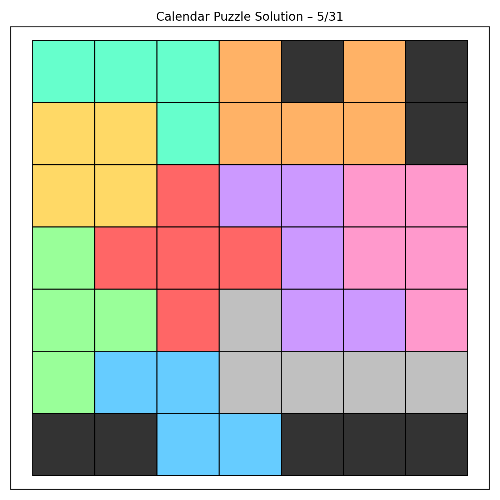

# Calendar Puzzle Solver

A solver for a 7x7 calendar puzzle. Given a month (1-12) and day (1-31), the solver places nine polyomino pieces onto the board while avoiding cells corresponding to that date.

## How it Works

- The board is a 7x7 grid with fixed blocked cells in the corners
- Each date blocks an additional cell (month in top-right area, day in the main grid)
- Nine polyomino pieces (NO FLIP, rotation only) must cover all remaining empty cells
- Uses backtracking to find a valid placement for each piece

## Usage

```bash
uv run python calendar_puzzle_solver.py <month> <day>

# Example
uv run python calendar_puzzle_solver.py 5 31
```

## Pieces

| Piece | Cells | Color |
|-------|-------|-------|
| SQ | 2x2 square | Yellow |
| CR | Cross | Red |
| SZ | Small Z | Light Blue |
| TT | T-shape | Green |
| NN | N-shape | Orange |
| LZ | L+Z combo | Purple |
| BB | B-shape | Pink |
| SL | S/L hybrid | Teal |
| LL | Long L | Silver |

## Example Output

